Supplementary material to: ‘Transition Network Analysis: A Novel Method
To Capture The Temporal, Relational And Centrality of The Learning
Process’
================

# Preparation

Importing libraries

``` r
library(dplyr)
library(TraMineR)
library(janitor)
library(tna) # devtools::install_github("anonymizedreview/tna", force = T)
library(ggseqplot)
library(seqHMM)
library(tidyr)
library(NetworkToolbox)
library(tibble)
library(gt)
library(patchwork)
library(reshape2)
library(networktools)
options(scipen = 999)
```

Importing the dataset (https://www.delibot.xyz/) and preparing it

``` r
combo_data <- rio::import("combo_data.csv")
combo_data_filtered <- combo_data |> 
  filter(!annotation_target %in% c("", "0", "None")) 

combod_withseq <- combo_data_filtered |> 
  group_by(group_id) |> 
  mutate(Sequence = seq_along(message_id)) |> 
  ungroup()

performance <- combod_withseq |> 
 group_by(group_id) |> 
 mutate(interactions = n()) |> 
 summarise_at(vars(performance_change, team_performance, interactions), 
              mean, na.rm = TRUE)

combo_freqs <- combod_withseq |> 
  tabyl(group_id, annotation_target) |> 
  as.data.frame() |> 
  left_join(performance)

data_reshaped <- dcast(group_id ~ Sequence, 
                                 data = combod_withseq, 
                                 value.var = "annotation_target")

data_joined <- left_join(combo_freqs, data_reshaped)
```

# General model

Building a sequence

``` r
seq_data <- seqdef(data_joined, 10:50)

ggseqdplot(seq_data)
```

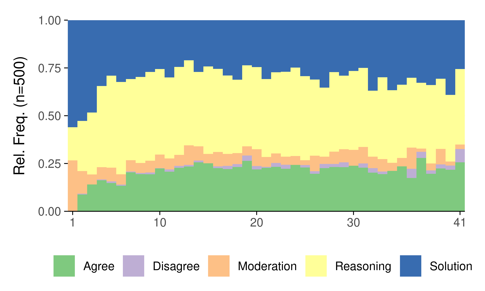

``` r
ggseqiplot(seq_data)
```

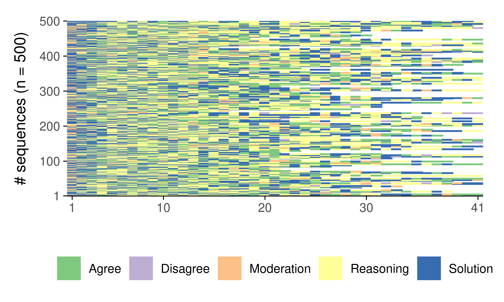

Building the TNA model

``` r
tna_model <- build_tna(seq_data)
```

Plotting the TNA model

``` r
plot(tna_model)
```

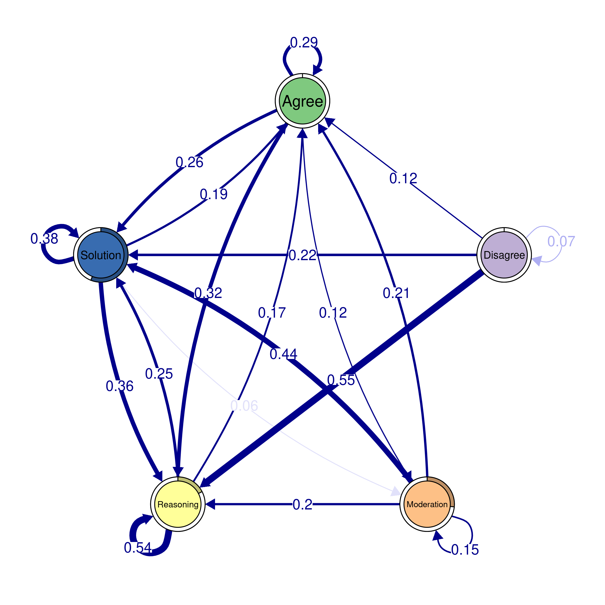

Initial probabilities

``` r
data.frame(`Initial prob.` = tna_model$inits[[1]]) |> 
  rownames_to_column("Interaction") |> arrange(desc(`Initial.prob.`)) |> 
  gt() |> fmt_percent()
```

<div id="jgnrpjptko" style="padding-left:0px;padding-right:0px;padding-top:10px;padding-bottom:10px;overflow-x:auto;overflow-y:auto;width:auto;height:auto;">

<table class="gt_table" data-quarto-disable-processing="false" data-quarto-bootstrap="false">
<thead>
<tr class="gt_col_headings">
      <th class="gt_col_heading gt_columns_bottom_border gt_left" rowspan="1" colspan="1" scope="col" id="Interaction">Interaction</th>
      <th class="gt_col_heading gt_columns_bottom_border gt_right" rowspan="1" colspan="1" scope="col" id="Initial.prob.">Initial.prob.</th>
    </tr>
</thead>
<tbody class="gt_table_body">
    <tr><td headers="Interaction" class="gt_row gt_left">Solution</td>
<td headers="Initial.prob." class="gt_row gt_right">56.00%</td></tr>
    <tr><td headers="Interaction" class="gt_row gt_left">Moderation</td>
<td headers="Initial.prob." class="gt_row gt_right">26.60%</td></tr>
    <tr><td headers="Interaction" class="gt_row gt_left">Reasoning</td>
<td headers="Initial.prob." class="gt_row gt_right">17.40%</td></tr>
    <tr><td headers="Interaction" class="gt_row gt_left">Agree</td>
<td headers="Initial.prob." class="gt_row gt_right">0.00%</td></tr>
    <tr><td headers="Interaction" class="gt_row gt_left">Disagree</td>
<td headers="Initial.prob." class="gt_row gt_right">0.00%</td></tr>
  </tbody>
  
  
</table>
</div>

Transition probabilities

``` r
tna_model$transits[[1]] |> data.frame() |> 
  rownames_to_column("From\\To") |> 
  gt() |> fmt_percent()
```

<div id="snozeiejys" style="padding-left:0px;padding-right:0px;padding-top:10px;padding-bottom:10px;overflow-x:auto;overflow-y:auto;width:auto;height:auto;">

<table class="gt_table" data-quarto-disable-processing="false" data-quarto-bootstrap="false">
  <thead>
    
    <tr class="gt_col_headings">
      <th class="gt_col_heading gt_columns_bottom_border gt_left" rowspan="1" colspan="1" scope="col" id="From\To">From\To</th>
      <th class="gt_col_heading gt_columns_bottom_border gt_right" rowspan="1" colspan="1" scope="col" id="Agree">Agree</th>
      <th class="gt_col_heading gt_columns_bottom_border gt_right" rowspan="1" colspan="1" scope="col" id="Disagree">Disagree</th>
      <th class="gt_col_heading gt_columns_bottom_border gt_right" rowspan="1" colspan="1" scope="col" id="Moderation">Moderation</th>
      <th class="gt_col_heading gt_columns_bottom_border gt_right" rowspan="1" colspan="1" scope="col" id="Reasoning">Reasoning</th>
      <th class="gt_col_heading gt_columns_bottom_border gt_right" rowspan="1" colspan="1" scope="col" id="Solution">Solution</th>
    </tr>
  </thead>
  <tbody class="gt_table_body">
    <tr><td headers="From\To" class="gt_row gt_left">Agree</td>
<td headers="Agree" class="gt_row gt_right">28.83%</td>
<td headers="Disagree" class="gt_row gt_right">0.81%</td>
<td headers="Moderation" class="gt_row gt_right">11.90%</td>
<td headers="Reasoning" class="gt_row gt_right">32.00%</td>
<td headers="Solution" class="gt_row gt_right">26.46%</td></tr>
    <tr><td headers="From\To" class="gt_row gt_left">Disagree</td>
<td headers="Agree" class="gt_row gt_right">12.09%</td>
<td headers="Disagree" class="gt_row gt_right">6.59%</td>
<td headers="Moderation" class="gt_row gt_right">4.40%</td>
<td headers="Reasoning" class="gt_row gt_right">54.95%</td>
<td headers="Solution" class="gt_row gt_right">21.98%</td></tr>
    <tr><td headers="From\To" class="gt_row gt_left">Moderation</td>
<td headers="Agree" class="gt_row gt_right">20.78%</td>
<td headers="Disagree" class="gt_row gt_right">0.42%</td>
<td headers="Moderation" class="gt_row gt_right">14.68%</td>
<td headers="Reasoning" class="gt_row gt_right">20.08%</td>
<td headers="Solution" class="gt_row gt_right">44.04%</td></tr>
    <tr><td headers="From\To" class="gt_row gt_left">Reasoning</td>
<td headers="Agree" class="gt_row gt_right">16.83%</td>
<td headers="Disagree" class="gt_row gt_right">1.07%</td>
<td headers="Moderation" class="gt_row gt_right">3.37%</td>
<td headers="Reasoning" class="gt_row gt_right">53.99%</td>
<td headers="Solution" class="gt_row gt_right">24.74%</td></tr>
    <tr><td headers="From\To" class="gt_row gt_left">Solution</td>
<td headers="Agree" class="gt_row gt_right">19.48%</td>
<td headers="Disagree" class="gt_row gt_right">0.92%</td>
<td headers="Moderation" class="gt_row gt_right">5.59%</td>
<td headers="Reasoning" class="gt_row gt_right">35.90%</td>
<td headers="Solution" class="gt_row gt_right">38.11%</td></tr>
  </tbody>
  
  
</table>
</div>

Centrality measures

``` r
centrality_measures = c("Betweenness", "Closeness", "InStrength", "OutStrength")

cents_withoutloops1 <- centralities(tna_model, measures = centrality_measures[1:2], 
                                   loops = FALSE, normalize = TRUE)
cents_withoutloops2 <- centralities(tna_model, measures = centrality_measures[3:4], 
                                   loops = FALSE, normalize = FALSE)

plot(cents_withoutloops2, ncol = 2, reorder = T,
     point_color = tna_model$colors, line_color = tna_model$colors) /
plot(cents_withoutloops1, ncol = 2, reorder = T,
     point_color = tna_model$colors, line_color = tna_model$colors) 
```

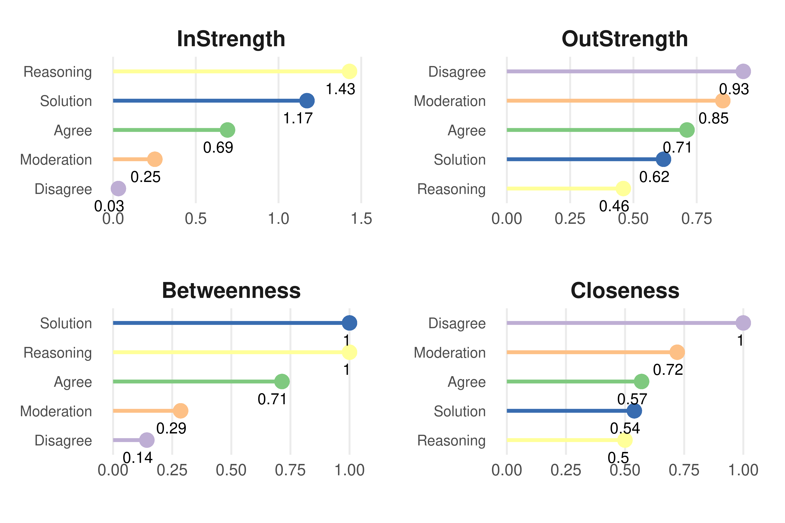

# Clustering

Initialization

``` r
set.seed(265)

Nvar <- length(alphabet(seq_data))
Nclusters <- 3
trans_probs <- simulate_transition_probs(Nvar, Nclusters)
init_probs <- simulate_initial_probs(Nvar, Nclusters)
```

Building and fitting the model (this might take a while…)

``` r
set.seed(265)
modelTrans <- build_mmm(seq_data, transition_probs = trans_probs,
 initial_probs = init_probs, data = data_joined, 
 formula = ~ 0 + team_performance)

controlEM = list(restart = list(times = 500, n_optimum = 501))

fitModelTrans <- fit_model(
 modelTrans, 
 global_step = TRUE,
 control_global = list(algorithm = "NLOPT_GD_STOGO_RAND"),
 local_step = TRUE,
 threads = 60,
 control_em = controlEM)
```

Plotting each cluster sequence

``` r
clusternames <- c("Solvers", "Regulated", "Debaters")

cluster_names(fitModelTrans$model) <- clusternames
sumamaryx <- summary(fitModelTrans$model)
ggseqdplot(seq_data, group = sumamaryx$most_probable_cluster) + 
  theme(strip.text = element_text(size = 17))
```

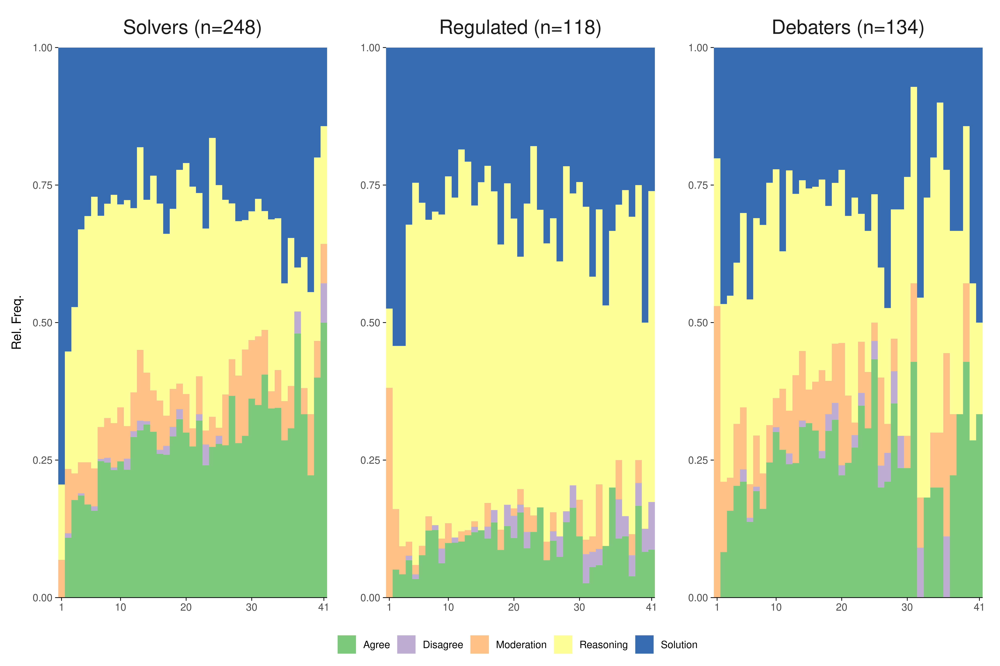

``` r
ggseqiplot(seq_data, group = sumamaryx$most_probable_cluster) + 
  theme(strip.text = element_text(size = 17))
```

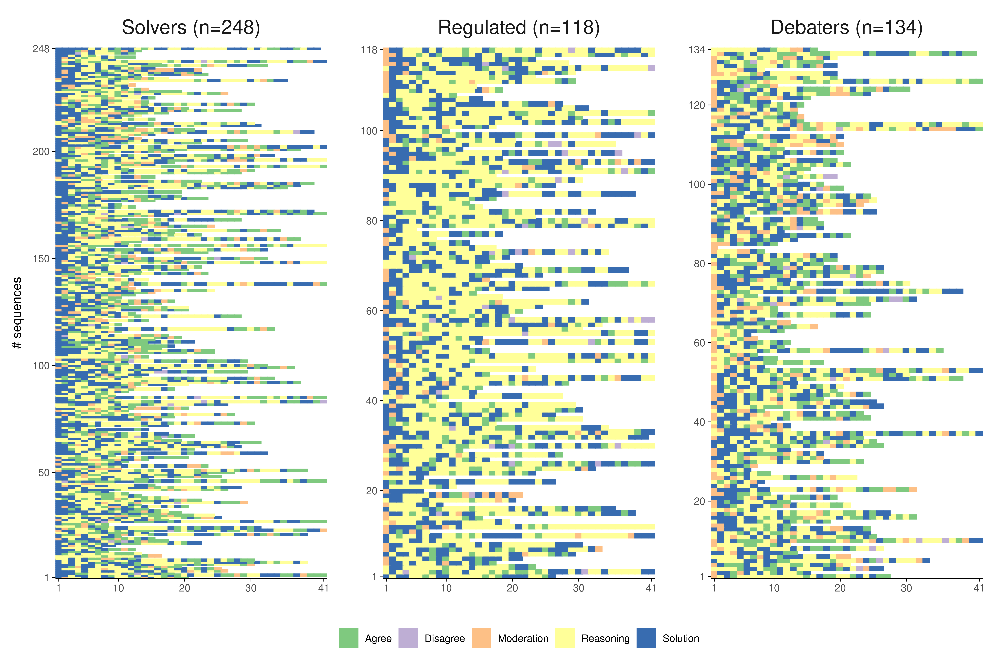

Covariate effects

``` r
summary(fitModelTrans$model)-> modelsummaryS

staderrors <- data.frame(
    sqrt(diag(modelsummaryS$vcov)), nrow(modelsummaryS$coefficients)) |> 
    rownames_to_column(var = "variables") |> rename(Error = 2) |> arrange(variables) 

coefficients <- modelsummaryS$coefficients|> as.data.frame() |> 
  rownames_to_column() |> as_tibble() |> 
  pivot_longer(c(3, 4)) |> 
  rename(Estimate = value, cluster = name) |> select (-2) |>
  mutate(variablescf= paste0(cluster, ": ", rowname)) |> arrange(variablescf)

calculatederrors <- cbind(coefficients, staderrors)

errorsx <- select(calculatederrors, variable = rowname, cluster, Estimate, Error)
errorsx$z <- errorsx$Estimate/errorsx$Error
errorsx$p <- (1 - pnorm(abs(errorsx$z), 0, 1)) * 2
errorsx$cilow=errorsx$Estimate -  qnorm(0.975) * errorsx$Error
errorsx$cihi=errorsx$Estimate +  qnorm(0.975) * errorsx$Error
errorsx |>  gt() |>
  fmt_number( decimals = 3)  
```

<div id="qcionpvyrz" style="padding-left:0px;padding-right:0px;padding-top:10px;padding-bottom:10px;overflow-x:auto;overflow-y:auto;width:auto;height:auto;">

<table class="gt_table" data-quarto-disable-processing="false" data-quarto-bootstrap="false">
  <thead>
    
    <tr class="gt_col_headings">
      <th class="gt_col_heading gt_columns_bottom_border gt_left" rowspan="1" colspan="1" scope="col" id="variable">variable</th>
      <th class="gt_col_heading gt_columns_bottom_border gt_left" rowspan="1" colspan="1" scope="col" id="cluster">cluster</th>
      <th class="gt_col_heading gt_columns_bottom_border gt_right" rowspan="1" colspan="1" scope="col" id="Estimate">Estimate</th>
      <th class="gt_col_heading gt_columns_bottom_border gt_right" rowspan="1" colspan="1" scope="col" id="Error">Error</th>
      <th class="gt_col_heading gt_columns_bottom_border gt_right" rowspan="1" colspan="1" scope="col" id="z">z</th>
      <th class="gt_col_heading gt_columns_bottom_border gt_right" rowspan="1" colspan="1" scope="col" id="p">p</th>
      <th class="gt_col_heading gt_columns_bottom_border gt_right" rowspan="1" colspan="1" scope="col" id="cilow">cilow</th>
      <th class="gt_col_heading gt_columns_bottom_border gt_right" rowspan="1" colspan="1" scope="col" id="cihi">cihi</th>
    </tr>
  </thead>
  <tbody class="gt_table_body">
    <tr><td headers="variable" class="gt_row gt_left">team_performance</td>
<td headers="cluster" class="gt_row gt_left">Debaters</td>
<td headers="Estimate" class="gt_row gt_right">−0.794</td>
<td headers="Error" class="gt_row gt_right">0.179</td>
<td headers="z" class="gt_row gt_right">−4.434</td>
<td headers="p" class="gt_row gt_right">0.000</td>
<td headers="cilow" class="gt_row gt_right">−1.146</td>
<td headers="cihi" class="gt_row gt_right">−0.443</td></tr>
    <tr><td headers="variable" class="gt_row gt_left">team_performance</td>
<td headers="cluster" class="gt_row gt_left">Regulated</td>
<td headers="Estimate" class="gt_row gt_right">−1.072</td>
<td headers="Error" class="gt_row gt_right">0.189</td>
<td headers="z" class="gt_row gt_right">−5.664</td>
<td headers="p" class="gt_row gt_right">0.000</td>
<td headers="cilow" class="gt_row gt_right">−1.443</td>
<td headers="cihi" class="gt_row gt_right">−0.701</td></tr>
  </tbody>
  
  
</table>
</div>

Creating a new model with the cluster information

``` r
tna_model_clus <- build_tna(fitModelTrans$model)
```

Initial probabilities

``` r
data.frame(tna_model_clus$inits) |> 
  rownames_to_column("Interaction") |>  
  gt() |> fmt_percent()
```

<div id="fwsveunwkm" style="padding-left:0px;padding-right:0px;padding-top:10px;padding-bottom:10px;overflow-x:auto;overflow-y:auto;width:auto;height:auto;">

<table class="gt_table" data-quarto-disable-processing="false" data-quarto-bootstrap="false">
  <thead>
    
    <tr class="gt_col_headings">
      <th class="gt_col_heading gt_columns_bottom_border gt_left" rowspan="1" colspan="1" scope="col" id="Interaction">Interaction</th>
      <th class="gt_col_heading gt_columns_bottom_border gt_right" rowspan="1" colspan="1" scope="col" id="Solvers">Solvers</th>
      <th class="gt_col_heading gt_columns_bottom_border gt_right" rowspan="1" colspan="1" scope="col" id="Regulated">Regulated</th>
      <th class="gt_col_heading gt_columns_bottom_border gt_right" rowspan="1" colspan="1" scope="col" id="Debaters">Debaters</th>
    </tr>
  </thead>
  <tbody class="gt_table_body">
    <tr><td headers="Interaction" class="gt_row gt_left">Agree</td>
<td headers="Solvers" class="gt_row gt_right">0.00%</td>
<td headers="Regulated" class="gt_row gt_right">0.00%</td>
<td headers="Debaters" class="gt_row gt_right">0.00%</td></tr>
    <tr><td headers="Interaction" class="gt_row gt_left">Disagree</td>
<td headers="Solvers" class="gt_row gt_right">0.00%</td>
<td headers="Regulated" class="gt_row gt_right">0.00%</td>
<td headers="Debaters" class="gt_row gt_right">0.00%</td></tr>
    <tr><td headers="Interaction" class="gt_row gt_left">Moderation</td>
<td headers="Solvers" class="gt_row gt_right">10.70%</td>
<td headers="Regulated" class="gt_row gt_right">35.16%</td>
<td headers="Debaters" class="gt_row gt_right">44.35%</td></tr>
    <tr><td headers="Interaction" class="gt_row gt_left">Reasoning</td>
<td headers="Solvers" class="gt_row gt_right">15.48%</td>
<td headers="Regulated" class="gt_row gt_right">12.57%</td>
<td headers="Debaters" class="gt_row gt_right">24.53%</td></tr>
    <tr><td headers="Interaction" class="gt_row gt_left">Solution</td>
<td headers="Solvers" class="gt_row gt_right">73.82%</td>
<td headers="Regulated" class="gt_row gt_right">52.27%</td>
<td headers="Debaters" class="gt_row gt_right">31.11%</td></tr>
  </tbody>
  
  
</table>
</div>

Transition probabilities

``` r
tna_model_clus$transits[[1]] |> data.frame() |> 
  rownames_to_column("From\\To") |> gt() |>
  tab_header(title = names(tna_model_clus$transits)[1]) |>
  fmt_percent()
```

<div id="vwjglrfuyt" style="padding-left:0px;padding-right:0px;padding-top:10px;padding-bottom:10px;overflow-x:auto;overflow-y:auto;width:auto;height:auto;">

<table class="gt_table" data-quarto-disable-processing="false" data-quarto-bootstrap="false">
  <thead>
    <tr class="gt_heading">
      <td colspan="6" class="gt_heading gt_title gt_font_normal gt_bottom_border" style>Solvers</td>
    </tr>
    
    <tr class="gt_col_headings">
      <th class="gt_col_heading gt_columns_bottom_border gt_left" rowspan="1" colspan="1" scope="col" id="From\To">From\To</th>
      <th class="gt_col_heading gt_columns_bottom_border gt_right" rowspan="1" colspan="1" scope="col" id="Agree">Agree</th>
      <th class="gt_col_heading gt_columns_bottom_border gt_right" rowspan="1" colspan="1" scope="col" id="Disagree">Disagree</th>
      <th class="gt_col_heading gt_columns_bottom_border gt_right" rowspan="1" colspan="1" scope="col" id="Moderation">Moderation</th>
      <th class="gt_col_heading gt_columns_bottom_border gt_right" rowspan="1" colspan="1" scope="col" id="Reasoning">Reasoning</th>
      <th class="gt_col_heading gt_columns_bottom_border gt_right" rowspan="1" colspan="1" scope="col" id="Solution">Solution</th>
    </tr>
  </thead>
  <tbody class="gt_table_body">
    <tr><td headers="From\To" class="gt_row gt_left">Agree</td>
<td headers="Agree" class="gt_row gt_right">33.31%</td>
<td headers="Disagree" class="gt_row gt_right">0.54%</td>
<td headers="Moderation" class="gt_row gt_right">14.66%</td>
<td headers="Reasoning" class="gt_row gt_right">26.25%</td>
<td headers="Solution" class="gt_row gt_right">25.24%</td></tr>
    <tr><td headers="From\To" class="gt_row gt_left">Disagree</td>
<td headers="Agree" class="gt_row gt_right">17.40%</td>
<td headers="Disagree" class="gt_row gt_right">5.16%</td>
<td headers="Moderation" class="gt_row gt_right">0.00%</td>
<td headers="Reasoning" class="gt_row gt_right">40.68%</td>
<td headers="Solution" class="gt_row gt_right">36.76%</td></tr>
    <tr><td headers="From\To" class="gt_row gt_left">Moderation</td>
<td headers="Agree" class="gt_row gt_right">38.73%</td>
<td headers="Disagree" class="gt_row gt_right">0.00%</td>
<td headers="Moderation" class="gt_row gt_right">15.13%</td>
<td headers="Reasoning" class="gt_row gt_right">14.88%</td>
<td headers="Solution" class="gt_row gt_right">31.27%</td></tr>
    <tr><td headers="From\To" class="gt_row gt_left">Reasoning</td>
<td headers="Agree" class="gt_row gt_right">18.69%</td>
<td headers="Disagree" class="gt_row gt_right">0.82%</td>
<td headers="Moderation" class="gt_row gt_right">2.38%</td>
<td headers="Reasoning" class="gt_row gt_right">52.54%</td>
<td headers="Solution" class="gt_row gt_right">25.57%</td></tr>
    <tr><td headers="From\To" class="gt_row gt_left">Solution</td>
<td headers="Agree" class="gt_row gt_right">21.40%</td>
<td headers="Disagree" class="gt_row gt_right">0.84%</td>
<td headers="Moderation" class="gt_row gt_right">7.13%</td>
<td headers="Reasoning" class="gt_row gt_right">31.70%</td>
<td headers="Solution" class="gt_row gt_right">38.93%</td></tr>
  </tbody>
  
  
</table>
</div>

``` r
tna_model_clus$transits[[2]] |> data.frame() |> 
  rownames_to_column("From\\To") |> gt() |>
  tab_header(title = names(tna_model_clus$transits)[2]) |>
  fmt_percent()
```

<div id="ggmzkromrl" style="padding-left:0px;padding-right:0px;padding-top:10px;padding-bottom:10px;overflow-x:auto;overflow-y:auto;width:auto;height:auto;">

<table class="gt_table" data-quarto-disable-processing="false" data-quarto-bootstrap="false">
  <thead>
    <tr class="gt_heading">
      <td colspan="6" class="gt_heading gt_title gt_font_normal gt_bottom_border" style>Regulated</td>
    </tr>
    
    <tr class="gt_col_headings">
      <th class="gt_col_heading gt_columns_bottom_border gt_left" rowspan="1" colspan="1" scope="col" id="From\To">From\To</th>
      <th class="gt_col_heading gt_columns_bottom_border gt_right" rowspan="1" colspan="1" scope="col" id="Agree">Agree</th>
      <th class="gt_col_heading gt_columns_bottom_border gt_right" rowspan="1" colspan="1" scope="col" id="Disagree">Disagree</th>
      <th class="gt_col_heading gt_columns_bottom_border gt_right" rowspan="1" colspan="1" scope="col" id="Moderation">Moderation</th>
      <th class="gt_col_heading gt_columns_bottom_border gt_right" rowspan="1" colspan="1" scope="col" id="Reasoning">Reasoning</th>
      <th class="gt_col_heading gt_columns_bottom_border gt_right" rowspan="1" colspan="1" scope="col" id="Solution">Solution</th>
    </tr>
  </thead>
  <tbody class="gt_table_body">
    <tr><td headers="From\To" class="gt_row gt_left">Agree</td>
<td headers="Agree" class="gt_row gt_right">8.49%</td>
<td headers="Disagree" class="gt_row gt_right">0.00%</td>
<td headers="Moderation" class="gt_row gt_right">3.79%</td>
<td headers="Reasoning" class="gt_row gt_right">52.62%</td>
<td headers="Solution" class="gt_row gt_right">35.10%</td></tr>
    <tr><td headers="From\To" class="gt_row gt_left">Disagree</td>
<td headers="Agree" class="gt_row gt_right">10.51%</td>
<td headers="Disagree" class="gt_row gt_right">5.73%</td>
<td headers="Moderation" class="gt_row gt_right">0.00%</td>
<td headers="Reasoning" class="gt_row gt_right">58.66%</td>
<td headers="Solution" class="gt_row gt_right">25.10%</td></tr>
    <tr><td headers="From\To" class="gt_row gt_left">Moderation</td>
<td headers="Agree" class="gt_row gt_right">1.27%</td>
<td headers="Disagree" class="gt_row gt_right">1.26%</td>
<td headers="Moderation" class="gt_row gt_right">8.08%</td>
<td headers="Reasoning" class="gt_row gt_right">23.74%</td>
<td headers="Solution" class="gt_row gt_right">65.65%</td></tr>
    <tr><td headers="From\To" class="gt_row gt_left">Reasoning</td>
<td headers="Agree" class="gt_row gt_right">11.06%</td>
<td headers="Disagree" class="gt_row gt_right">1.36%</td>
<td headers="Moderation" class="gt_row gt_right">1.46%</td>
<td headers="Reasoning" class="gt_row gt_right">63.92%</td>
<td headers="Solution" class="gt_row gt_right">22.21%</td></tr>
    <tr><td headers="From\To" class="gt_row gt_left">Solution</td>
<td headers="Agree" class="gt_row gt_right">12.40%</td>
<td headers="Disagree" class="gt_row gt_right">1.48%</td>
<td headers="Moderation" class="gt_row gt_right">4.32%</td>
<td headers="Reasoning" class="gt_row gt_right">42.85%</td>
<td headers="Solution" class="gt_row gt_right">38.95%</td></tr>
  </tbody>
  
  
</table>
</div>

``` r
tna_model_clus$transits[[3]] |> data.frame() |> 
  rownames_to_column("From\\To") |> gt() |>
  tab_header(title = names(tna_model_clus$transits)[3]) |>
  fmt_percent()
```

<div id="fiotwgjyav" style="padding-left:0px;padding-right:0px;padding-top:10px;padding-bottom:10px;overflow-x:auto;overflow-y:auto;width:auto;height:auto;">

<table class="gt_table" data-quarto-disable-processing="false" data-quarto-bootstrap="false">
  <thead>
    <tr class="gt_heading">
      <td colspan="6" class="gt_heading gt_title gt_font_normal gt_bottom_border" style>Debaters</td>
    </tr>
    
    <tr class="gt_col_headings">
      <th class="gt_col_heading gt_columns_bottom_border gt_left" rowspan="1" colspan="1" scope="col" id="From\To">From\To</th>
      <th class="gt_col_heading gt_columns_bottom_border gt_right" rowspan="1" colspan="1" scope="col" id="Agree">Agree</th>
      <th class="gt_col_heading gt_columns_bottom_border gt_right" rowspan="1" colspan="1" scope="col" id="Disagree">Disagree</th>
      <th class="gt_col_heading gt_columns_bottom_border gt_right" rowspan="1" colspan="1" scope="col" id="Moderation">Moderation</th>
      <th class="gt_col_heading gt_columns_bottom_border gt_right" rowspan="1" colspan="1" scope="col" id="Reasoning">Reasoning</th>
      <th class="gt_col_heading gt_columns_bottom_border gt_right" rowspan="1" colspan="1" scope="col" id="Solution">Solution</th>
    </tr>
  </thead>
  <tbody class="gt_table_body">
    <tr><td headers="From\To" class="gt_row gt_left">Agree</td>
<td headers="Agree" class="gt_row gt_right">31.61%</td>
<td headers="Disagree" class="gt_row gt_right">1.68%</td>
<td headers="Moderation" class="gt_row gt_right">11.35%</td>
<td headers="Reasoning" class="gt_row gt_right">31.25%</td>
<td headers="Solution" class="gt_row gt_right">24.10%</td></tr>
    <tr><td headers="From\To" class="gt_row gt_left">Disagree</td>
<td headers="Agree" class="gt_row gt_right">7.84%</td>
<td headers="Disagree" class="gt_row gt_right">9.48%</td>
<td headers="Moderation" class="gt_row gt_right">15.61%</td>
<td headers="Reasoning" class="gt_row gt_right">67.07%</td>
<td headers="Solution" class="gt_row gt_right">0.00%</td></tr>
    <tr><td headers="From\To" class="gt_row gt_left">Moderation</td>
<td headers="Agree" class="gt_row gt_right">7.73%</td>
<td headers="Disagree" class="gt_row gt_right">0.55%</td>
<td headers="Moderation" class="gt_row gt_right">17.00%</td>
<td headers="Reasoning" class="gt_row gt_right">24.73%</td>
<td headers="Solution" class="gt_row gt_right">49.98%</td></tr>
    <tr><td headers="From\To" class="gt_row gt_left">Reasoning</td>
<td headers="Agree" class="gt_row gt_right">22.88%</td>
<td headers="Disagree" class="gt_row gt_right">1.05%</td>
<td headers="Moderation" class="gt_row gt_right">8.07%</td>
<td headers="Reasoning" class="gt_row gt_right">40.65%</td>
<td headers="Solution" class="gt_row gt_right">27.36%</td></tr>
    <tr><td headers="From\To" class="gt_row gt_left">Solution</td>
<td headers="Agree" class="gt_row gt_right">23.70%</td>
<td headers="Disagree" class="gt_row gt_right">0.45%</td>
<td headers="Moderation" class="gt_row gt_right">4.26%</td>
<td headers="Reasoning" class="gt_row gt_right">35.81%</td>
<td headers="Solution" class="gt_row gt_right">35.79%</td></tr>
  </tbody>
  
  
</table>
</div>

Plotting the cluster transitions

``` r
layout(t(1:3))
plot(tna_model_clus, cluster = 1, edge.label.cex = 2, vsize = 18, 
     title = clusternames[1], title.cex = 2.5)
plot(tna_model_clus, cluster = 2, edge.label.cex = 2, vsize = 18, 
     title = clusternames[2], title.cex = 2.5)
plot(tna_model_clus, cluster = 3, edge.label.cex = 2, vsize = 18, 
     title = clusternames[3], title.cex = 2.5)
```

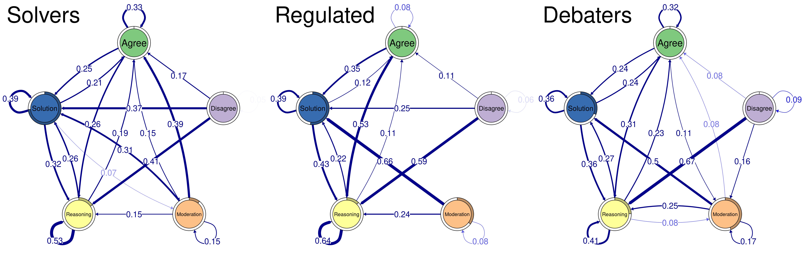

Cluster centralities

``` r
layout(t(1:2))
centralities_per_cluster1 <- centralities(tna_model_clus, normalize = T, 
                                         measures = centrality_measures[1:2])

centralities_per_cluster2 <- centralities(tna_model_clus, normalize = F, 
                                         measures = centrality_measures[3:4])

centralities_per_cluster <- cbind(centralities_per_cluster1 |> select(1:3),
                     centralities_per_cluster2 |> select(2:4)) |> as_centralities()
  
plot(centralities_per_cluster)
```

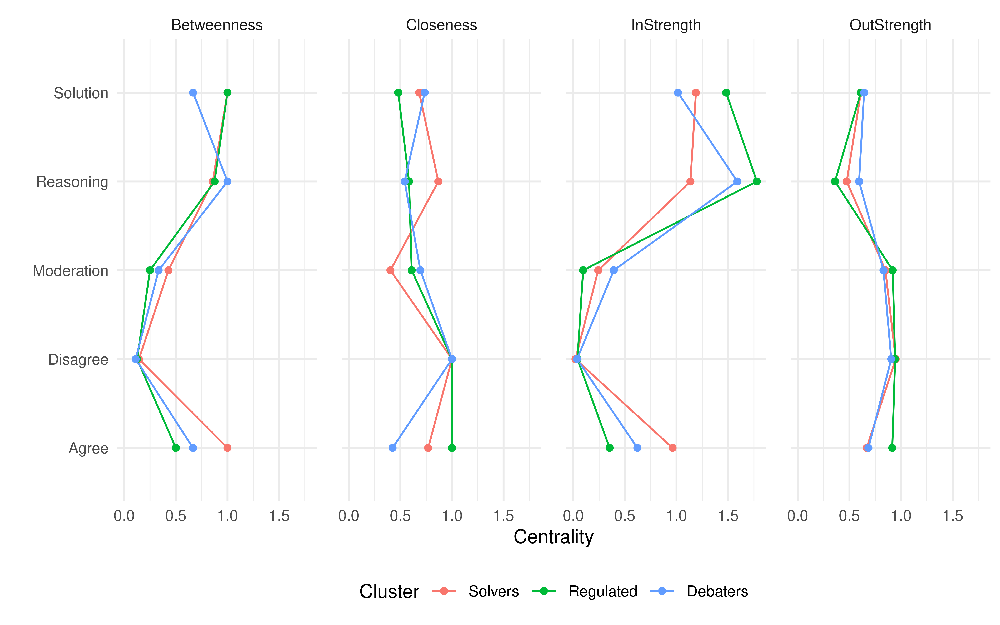

Communities

``` r
set.seed(265)

layout(t(1:3))
Bridging1 <- bridge(fitModelTrans$model$transition_probs$Solvers) 
plot(tna_model_clus, cluster = 1, edge.label.cex = 2, pie = NULL, vsize = 20,
     color = Bridging1$communities, title = clusternames[1], title.cex = 2.5)

Bridging2 <- bridge(fitModelTrans$model$transition_probs$Regulated) 
plot(tna_model_clus, cluster = 2, edge.label.cex = 2, pie = NULL, vsize = 20, 
     color = Bridging2$communities, title = clusternames[2], title.cex = 2.5)

Bridging3 <- bridge(fitModelTrans$model$transition_probs$Debaters) 
plot(tna_model_clus, cluster = 3, edge.label.cex = 2, pie = NULL, vsize = 20, 
     color = Bridging3$communities, title = clusternames[3], title.cex = 2.5)
```

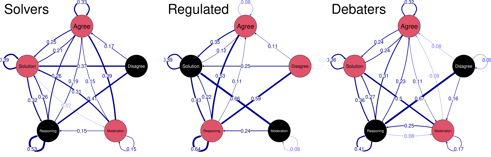

# Comparing high achievers to the rest

Identify high achievers

``` r
top10 <- quantile(data_joined$team_performance, c(0.9))
```

Create one model for high achievers and one for low achievers

``` r
layout(t(1:2))

#Difference
LowAchievers = data_joined$team_performance < top10 
HighAchievers <- data_joined$team_performance > top10 

low_model <- build_tna(seq_data[LowAchievers,]); 
plot(low_model, title = "Low achievers")

high_model <- build_tna(seq_data[HighAchievers,]); 
plot(high_model, title = "High achievers")
```

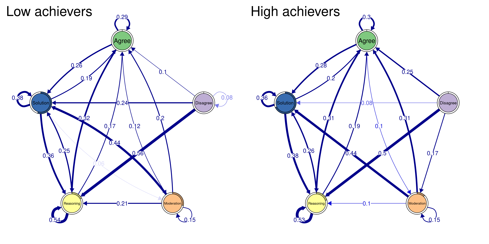

Comparing high vs. low achievers’ transitions

``` r
layout(t(1:2))

plot(high_model, title = "High achievers")
plot_compare(high_model, low_model, title = "High - Low" )
```

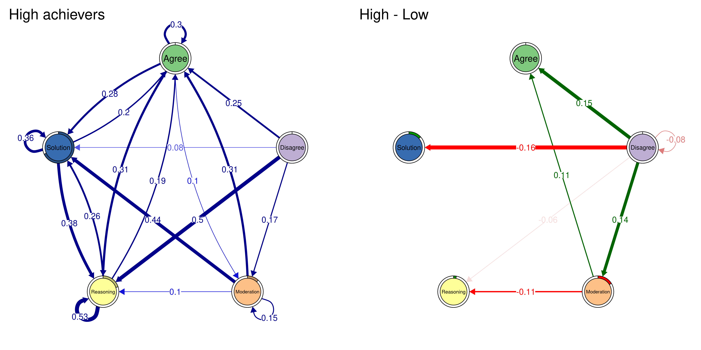
